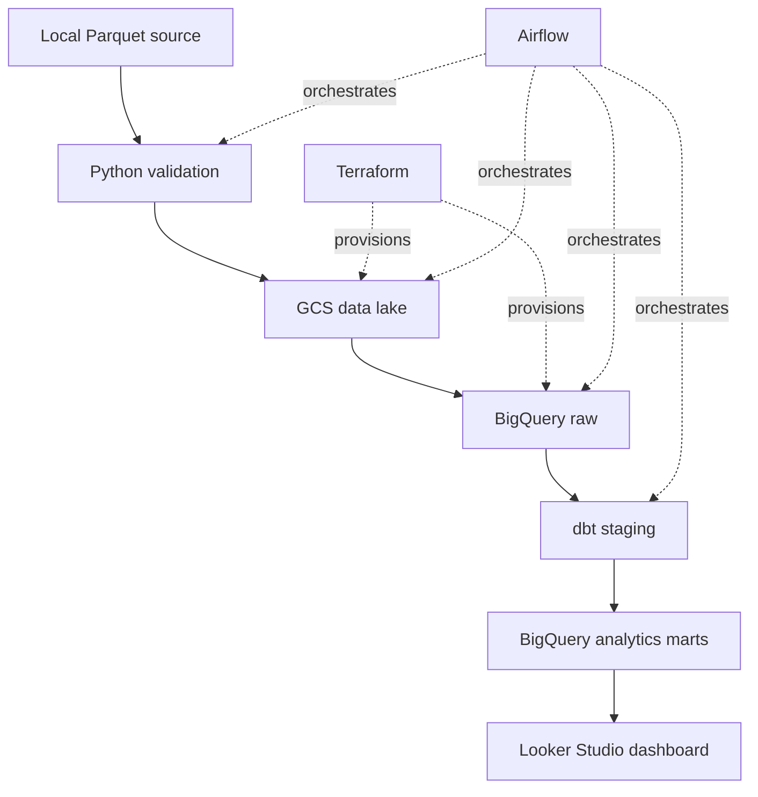

# Paris Vélib Availability Pipeline

An end-to-end batch data engineering project that processes historical Paris Vélib station availability data and identifies stations that may require bicycle rebalancing.

## Business Problem

Vélib users may arrive at a station and find:

- No bicycle available to rent
- No free dock available to return a bicycle
- A station temporarily closed

This project builds a reproducible batch pipeline that helps an operations team answer:

- Which stations are frequently empty or full?
- Which stations should receive the highest rebalancing priority?
- At what hours are availability problems most common?
- How do weather conditions relate to network availability?
- How often are stations unavailable because they are closed?

## Dataset

The project uses the [Vélib Data dataset from Kaggle](https://www.kaggle.com/datasets/adrienmorel97/velib-data).

Each row represents the state of one Vélib station during a five-minute snapshot.

### Dataset profile

| Metric | Value |
|---|---:|
| Rows | 6,353,181 |
| Columns | 14 |
| Stations | 1,503 |
| Five-minute time bins | 4,227 |
| Earliest observation | 2025-12-02 00:00:49 UTC |
| Latest observation | 2025-12-16 16:35:37 UTC |
| Local file size | 52.58 MiB |
| Missing values | 0 |
| Duplicate station/time keys | 0 |

The dataset includes:

- Observation timestamps
- Station identifiers and names
- Geographic coordinates
- Available mechanical bicycles
- Available electric bicycles
- Total available bicycles
- Station capacity and operational status
- Temperature, precipitation and wind speed

## Architecture



### Pipeline layers

1. Python validates the source Parquet file.
2. The unchanged raw file is uploaded to Google Cloud Storage.
3. The GCS object is loaded into a BigQuery raw table.
4. dbt converts raw timestamps, adds quality flags and creates analytics models.
5. dbt tests validate keys, accepted values, rates and aggregate totals.
6. Airflow orchestrates the complete dependency chain.
7. Looker Studio visualizes the analytical models.

## Technology Stack

| Area | Technology |
|---|---|
| Language | Python 3.13 |
| Dependency management | uv |
| Data format | Apache Parquet |
| Cloud platform | Google Cloud Platform |
| Data lake | Google Cloud Storage |
| Data warehouse | BigQuery |
| Infrastructure as code | Terraform |
| Transformations | dbt Core |
| Orchestration | Apache Airflow |
| Containerization | Docker and Docker Compose |
| Dashboard | Looker Studio |
| Version control | Git and GitHub |

## Cloud Resources

Terraform provisions:

- Required Cloud Storage and BigQuery APIs
- Private EU Google Cloud Storage bucket
- `velib_raw` BigQuery dataset
- `velib_analytics` BigQuery dataset

The main resources are:

```text
GCS:
gs://paris-velib-de-fs-2026-data-lake

BigQuery raw table:
paris-velib-de-fs-2026.velib_raw.station_availability

BigQuery analytics dataset:
paris-velib-de-fs-2026.velib_analytics
```

Public access prevention and uniform bucket-level access are enabled on the data-lake bucket.

## Data Quality

Raw-data profiling identified:

| Check | Result |
|---|---:|
| Missing key values | 0 |
| Rows with missing values | 0 |
| Negative bicycle or capacity counts | 0 |
| Duplicate station/time rows | 0 |
| Bicycles exceeding capacity | 11,411 |
| Inconsistent bicycle totals | 35,836 |
| Closed-station observations | 154,286 |
| Unexpected status values | 0 |

The original source records are preserved. Potential inconsistencies are represented through quality flags rather than silently removed or modified.

## dbt Models

### `stg_station_availability`

A staging view that:

- Converts nanosecond integer timestamps into BigQuery timestamps
- Standardizes source fields
- Preserves the original observations
- Adds operational and data-quality flags
- Identifies empty, full and closed station observations

### `fct_station_performance`

A table containing one row per station with:

- Empty-station rate
- Full-station rate
- Availability-issue rate
- Closed-station rate
- Mechanical and electric bicycle availability
- Rebalancing priority score
- High, medium or low priority classification

The model contains 1,503 unique stations.

### `fct_network_hourly`

An hourly network-level table containing:

- Average operational stations
- Average empty and full stations
- Network availability-issue rate
- Paris local hour and weekday
- Temperature and precipitation metrics

The model contains 353 hourly rows representing all 4,227 source time bins.

## dbt Testing

The project includes generic and singular tests covering:

- Unique station/time keys
- Unique station IDs in the station mart
- Unique hourly timestamps
- Required non-null values
- Accepted status and priority values
- Valid percentage ranges
- Preservation of source observation totals
- Preservation of hourly time-bin totals

All 29 dbt tests pass.

Run the models and tests locally:

```bash
uv run dbt run \
  --project-dir dbt \
  --profiles-dir ~/.dbt
```

```bash
uv run dbt test \
  --project-dir dbt \
  --profiles-dir ~/.dbt
```

## Airflow Orchestration

The Airflow DAG is:

```text
paris_velib_pipeline
```

It contains five dependent tasks:

```text
validate_source_file
→ upload_raw_file_to_gcs
→ load_raw_table_to_bigquery
→ run_dbt_models
→ test_dbt_models
```

The pipeline is idempotent:

- An identical GCS object is not uploaded again.
- An existing BigQuery raw table is not accidentally replaced.
- dbt models can be rebuilt safely.
- A failed dbt test causes the Airflow run to fail.

The DAG currently uses manual triggering because the source is a fixed historical Kaggle file:

```python
schedule=None
```

A recurring schedule can be introduced when the pipeline uses a changing API or regularly delivered source file.

### Start Airflow

The local `.env` file must provide the Airflow UID, Fernet key, Application Default Credentials path and dbt profile path.

Build and initialize the environment:

```bash
docker compose \
  -f orchestration/airflow/docker-compose.yaml \
  build
```

```bash
docker compose \
  -f orchestration/airflow/docker-compose.yaml \
  up airflow-init
```

Start Airflow:

```bash
docker compose \
  -f orchestration/airflow/docker-compose.yaml \
  up -d
```

Open:

```text
http://localhost:8080
```

Stop Airflow without deleting its metadata:

```bash
docker compose \
  -f orchestration/airflow/docker-compose.yaml \
  down
```

## Infrastructure Deployment

Create a local variables file:

```bash
cp terraform/terraform.tfvars.example terraform/terraform.tfvars
```

Initialize and validate Terraform:

```bash
terraform -chdir=terraform init
terraform -chdir=terraform validate
terraform -chdir=terraform plan
```

Provision the infrastructure after reviewing the plan:

```bash
terraform -chdir=terraform apply
```

Terraform state and local variable files are excluded from Git.

## Manual Ingestion

Upload the validated Parquet source to GCS:

```bash
uv run python ingestion/upload_to_gcs.py \
  --bucket paris-velib-de-fs-2026-data-lake
```

Load the GCS object into BigQuery:

```bash
uv run python ingestion/load_gcs_to_bigquery.py
```

The Airflow DAG automates these steps as one dependency-controlled workflow.

## Repository Structure

```text
.
├── dashboard/                 # Dashboard documentation and screenshots
├── data/raw/                  # Local source data excluded from Git
├── dbt/
│   ├── models/staging/        # Cleaned source representation
│   ├── models/marts/          # Business-facing analytical models
│   └── tests/                 # Singular dbt tests
├── docs/                      # Architecture and project documentation
├── ingestion/                 # GCS and BigQuery ingestion scripts
├── orchestration/airflow/     # Airflow Docker environment and DAG
├── terraform/                 # GCP infrastructure as code
└── tests/                     # Raw BigQuery quality checks
```

## Security and Cost Controls

- Credentials and local environment files are excluded from Git.
- Application Default Credentials are mounted read-only in Airflow.
- The repository is mounted read-only inside Airflow containers.
- The GCS bucket prevents public access.
- BigQuery commands use maximum-bytes-billed limits where appropriate.
- A GCP budget alert monitors project usage.
- Terraform protects non-empty storage resources from accidental deletion.

## Dashboard

The Looker Studio dashboard will use:

```text
velib_analytics.fct_station_performance
velib_analytics.fct_network_hourly
```

Planned dashboard components include:

- Network availability KPIs
- Highest-priority rebalancing stations
- Empty and full station rates
- Hourly availability patterns
- Geographic station analysis
- Weather and availability comparisons

## Current Status

- [x] Profile and validate source data
- [x] Provision GCP infrastructure with Terraform
- [x] Upload raw data to GCS
- [x] Load raw data into BigQuery
- [x] Build dbt staging and analytics models
- [x] Add automated data-quality tests
- [x] Orchestrate the pipeline with Airflow
- [ ] Build the Looker Studio dashboard
- [ ] Add dashboard screenshots
- [ ] Complete final project documentation
